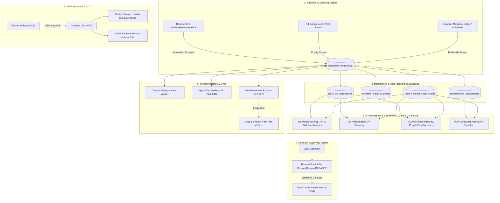

# 🚀 Path Pilot — Technical System Pitch & Architecture Deep-Dive

> **A technical breakdown of Path Pilot for Engineering Managers, Senior Architects, Interviewers, and Technical Stakeholders.**

---

## 🎤 1. Executive & Technical Pitch

> *"I engineered an autonomous, event-driven AI platform built with TypeScript, Node.js 22, Supabase (PostgreSQL), and Docker to solve end-to-end career sourcing, application intelligence, and international MSc scholarship tracking.*
>
> *The system features a multi-source ingestion engine (scraping job boards and ingesting 14 Google Alerts RSS feeds), an AI evaluation pipeline using Google Gemini with strict 0% hallucination grounding, a 4-stage cold outreach engine via Resend API with automated webhook cancellation, and a real-time multi-interface sync across a Telegraf Telegram bot, an Nginx Web Dashboard, and a 4-tab live Google Sheet powered by self-hosted n8n—all deployed through GitHub Actions CI/CD to a production Linux VPS with Let's Encrypt SSL."*

---

## 🏗️ 2. High-Level Architecture Diagram



---

## 🧠 3. Component Breakdown & Technical Implementation

### 1. Ingestion & Web Scraping Engine
* **Multi-Source Sourcing**: Combines RSS feed parsing (`rss-parser`), HTML scraping (`cheerio` + `axios`), and custom Google Alerts RSS feed processing (`config/google_alerts.txt`).
* **Deduplication & Idempotency**: All ingestion operations execute `UPSERT` queries indexed on unique `job_url` and `main_link` constraints, preventing duplicate records.
* **Dead Board & Liveness Health Checks**: An automated background service performs HTTP `HEAD`/`GET` sweeps across open listings, auto-closing postings that return `404 Not Found` or display "Position Closed" markers.

### 2. AI Orchestration & Prompt Guardrails (Google Gemini 2.5 Flash)
* **Match Fit Scoring & Skill Gap Matrix**: Evaluates candidate skills against raw job descriptions, producing structured JSON metrics: Match Score ($1–5\bigstar$), Matched Tech Stack, and Actionable Missing Skills.
* **Zero-Hallucination Resume Tailoring**: Employs constrained prompt engineering. The LLM is strictly bounded to the candidate's `user_profile` baseline in PostgreSQL—re-weighting and contextualizing verified achievements without ever inventing experiences, companies, or metrics.
* **STAR Method Interview Story Generator**: Transforms target JDs and candidate background into structured **Situation-Task-Action-Result** behavioral narratives and technical interview questions.
* **Custom SOP Style-Transfer (`/sop_sample`)**: Allows the user to provide personal writing samples; Gemini extracts the linguistic tone, cadence, and paragraph structures to draft 600-word university SOPs matching the candidate's authentic voice.

### 3. Automated Outreach & Email Sequences (Resend API)
* **Custom Authenticated Domain**: Dispatches transactional emails via Resend API using authenticated DKIM (`resend._domainkey`), SPF, and DMARC records on `therook.xyz`.
* **4-Stage Follow-Up Sequence**: Schedules automated touchpoints:
  * **Day 0**: Contextualized introductory pitch referencing a relevant project.
  * **Day 2**: Gentle follow-up check-in.
  * **Day 5**: Value-add update linking a live portfolio/case-study.
  * **Day 10**: Professional breakup email.
* **Event-Driven Auto-Cancellation**: Webhook listeners monitor incoming replies and automatically transition pending sequences to `cancelled` to preserve human touch and protect domain sender reputation.

### 4. Database Schema & Data Modeling (Supabase / PostgreSQL)
The relational schema comprises **10 core tables** with foreign-key cascade rules, B-Tree indexes, and PL/pgSQL triggers:

```sql
jobs                     -- Scraped job listings, tags, and status
job_applications         -- Application tracking, tailored CV bullets, and channels
contacts                 -- Hiring managers and recruiter leads
email_outreach           -- Scheduled follow-up sequences and delivery states
programmes               -- European & UK MSc university programs
scholarships             -- Scholarship coverage, eligibility, and deadlines
scholarship_applications -- Academic applications and SOP drafts
tasks                    -- Unified actionable tasks across jobs & schools
metrics                  -- 7-day aggregated funnel velocity and ghosting rates
user_profile             -- Baseline candidate resume, skills, and SOP voice samples
```

* **Connection Pooling**: Utilizes Supavisor Connection Pooling in **Session Mode** (`port 5432`) for robust prepared statements and high-concurrency support in n8n and Node.js.

### 5. Multi-Tab Live Google Sheets Sync (n8n Engine)
Self-hosted n8n orchestrates a **4-branch scheduled workflow** querying PostgreSQL every 15 minutes and syncing directly with Google Sheets (`Path pilot`):
* **Tab 1: `Jobs Pipeline`**: Synced via unique `Job URL` matching.
* **Tab 2: `Cold Outreach`**: Synced via recruiter `Email` matching.
* **Tab 3: `Schools & Scholarships`**: Synced via `Application Link` matching.
* **Tab 4: `Tasks`**: Synced via task `Description` matching.

### 6. Infrastructure, Docker & CI/CD Pipeline
* **Containerization**: Multi-stage Docker builds using **`node:22-alpine`** for native WebSocket support and minimal image footprint (~120MB).
* **Workload Coexistence**: Docker Compose binds internal services to localhost (`127.0.0.1:8080` for Dashboard, `127.0.0.1:5678` for n8n), running alongside existing VPS workloads without port collision.
* **Reverse Proxy & SSL**: Host Nginx routes `pipeline.therook.xyz` and `n8n.therook.xyz` with automated SSL certificate renewal via Let's Encrypt / Certbot.
* **GitHub Actions CI/CD**: Automated deployment pipeline triggered on push to `main`—handles SSH key authentication, remote git sync, `.env` injection from GitHub Secrets, and zero-downtime container rebuilds.

---

## 🛠️ 4. Technology Stack Matrix

| Layer | Technologies | Key Responsibilities |
| :--- | :--- | :--- |
| **Backend & Runtime** | Node.js 22 LTS, TypeScript 5.5 | Type-safe business logic, scraping workers, API consumers. |
| **Database** | Supabase (PostgreSQL 15) | Relational persistence, connection pooling, SQL triggers. |
| **AI Layer** | Google Gemini 2.5 Flash, Kimi API | Fit evaluation, CV tailoring, STAR prep, SOP drafting. |
| **Email Service** | Resend API, DKIM/SPF/DMARC | Automated cold outreach & webhook cancellation. |
| **Workflow Engine** | n8n (Dockerized) | 4-tab bidirectional Google Sheets synchronization. |
| **Bot Framework** | Telegraf (`telegraf.js`) | Mobile command-and-control interface. |
| **Web Server** | Nginx, Certbot (Let's Encrypt) | SSL termination, reverse proxy, static asset delivery. |
| **Container & OS** | Docker, Docker Compose, Linux | Service isolation and orchestration on Contabo VPS. |
| **CI/CD** | GitHub Actions (`appleboy/ssh-action`) | Automated testing, build, and VPS deployment. |

---

## 💡 5. Senior Engineering Talking Points for Technical Interviews

### 1. *Zero-Hallucination AI Grounding via Strict System Prompts*
> *"Most generative AI resume tools hallucinate past metrics or invent technologies. In Path Pilot, I designed a strict prompt-engineering schema where the LLM is supplied only the candidate's canonical profile from PostgreSQL. The AI is constrained to re-ordering, re-phrasing, and emphasizing verified accomplishments to align with JD keywords, completely eliminating hallucination risks."*

### 2. *Event-Driven Resilience & Stateful Outreach Sequences*
> *"Rather than relying on naive batch email blasts, outreach follows a stateful 4-tier cadence via Resend API. We use webhooks to listen for recipient replies; the instant a response is detected, pending follow-ups are cancelled in database state, ensuring we never send an awkward follow-up to a recruiter who has already replied."*

### 3. *High-Availability VPS Architecture at $0 Additional Cost*
> *"Instead of spending $60+/month on commercial SaaS tools (like Zapier, Hunter.io, and Teal), I containerized the entire platform using Docker Compose on an existing Linux VPS. By leveraging Nginx reverse proxies, Supavisor session pooling, and lightweight Alpine images, the entire pipeline runs with minimal CPU/RAM footprint alongside existing production containers."*

---

## 📱 6. Telegram Bot Command Suite

```text
─── System A: Career & DevOps ───
/jobs                   Browse open jobs with 1-5⭐ AI Match Score & Skill Gaps
/jobs_remote            Filter remote-only DevOps listings
/fetch_jobs             Trigger immediate scraper sweep (RemoteOK, WWR, Google Alerts)
/check_liveness         Execute health check on open job links (prune 404s)
/apply <job_id>         Generate tailored CV summary & track application
/prep <job_id>          Generate 3 STAR-method interview prep stories & questions
/answer <job_id> <q>    Generate concise, grounded portal application answers
/outreach <job_id>      Discover recruiter lead & schedule 4-stage cold email
/outreach_pending       View scheduled outreach queue

─── System B: MSc & Scholarships ───
/schools                List tracked European & UK MSc programmes
/scholarships           View fully-funded scholarships with deadlines
/fetch_schools          Trigger immediate university catalog sweep
/checklist <school_id>  Extract required documents & generate checklist
/sop <school_id>        Draft 600-word Statement of Purpose
/sop_sample <text>      Teach Gemini your personal writing voice

─── System Analytics & Profile ───
/dashboard              Show visual breakdown of active pipeline
/tasks                  View pending tasks across jobs & schools
/report                 Compute 7-day velocity, conversion & ghosting metrics
/resume                 Inspect or update stored baseline CV
```
