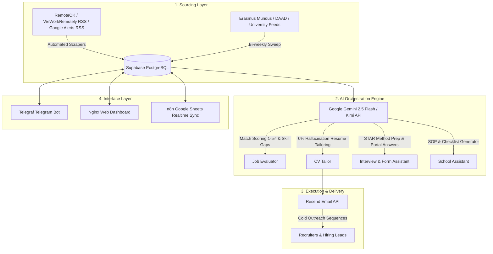

# 🚀 Autonomous DevOps Career Pipeline & MSc Scholarship Tracker

[](https://www.typescriptlang.org/)
[](https://nodejs.org/)
[](https://supabase.com/)
[](https://telegraf.js.org/)
[](https://www.docker.com/)
[](LICENSE)

An end-to-end, automation-heavy AI system designed for **DevOps, Cloud, SRE, and DevSecOps professionals**. 

The repository implements two connected autonomous pipelines managed via a **Telegram Bot**, a **Self-Hosted Web Dashboard**, and **Live Google Sheets Synchronization**:

1. **System A – Career Pipeline**: Automated job sourcing (RemoteOK, WeWorkRemotely, Google Alerts RSS), AI match scoring (1–5⭐), skill gap analysis, AI resume tailoring (0% hallucination), recruiter lead discovery, cold email outreach sequences (Resend API), STAR interview prep, and application portal form answer assistance.
2. **System B – Scholarship & School Tracker**: Sourcing for international MSc programmes (SECCLO Erasmus Mundus, EIT Digital Cloud, KTH Cybersecurity, DAAD Germany), AI document checklist extraction, customized Statement of Purpose (SOP) generation with style guide grounding, and deadline alerts.

---

## 🏗️ System Architecture



---

## ✨ Core Features

### System A – Career Pipeline
* ⭐ **AI Job Match Scoring (1–5 Stars) & Skill Gap Matrix**: Gemini AI automatically scores open job listings from 1 to 5 Stars based on candidate fit and highlights matched vs missing skills (e.g. `✅ Matched: Kubernetes, Terraform | ⚠️ Skill Gap: ArgoCD`).
* 🔍 **Multi-Source Job Sourcing + Google Alerts RSS**: Scrapes RemoteOK, WeWorkRemotely, and Google Alerts RSS feeds every 6 hours with automatic deduplication (`UPSERT` on `job_url`).
* 🎯 **AI Resume Tailoring Engine**: Aligns keywords, re-orders bullet points, and writes 3-sentence executive summaries tailored to target JDs with strict zero-hallucination guardrails.
* 📧 **Automated Cold Email Outreach**: Generates personalized cold emails and multi-stage follow-up sequences (Day 0, Day 2, Day 5, Day 10) via **Resend API**. Features automatic sequence cancellation when recipient reply is detected.
* 🔗 **Automated Job Liveness & Dead Board Checker**: Daily health checker pings open job URLs and automatically marks expired/404 postings as `closed`.
* 🎯 **STAR Method Interview Prep Generator (`/prep`)**: Constructs 3 custom Situation-Task-Action-Result interview stories + technical questions for target jobs.
* ✍️ **Application Form Answer Assistant (`/answer`)**: Writes 60–120 word grounded responses for custom portal form questions (e.g. *"Why Canva?"*, *"Describe a complex cloud problem you solved"*).
* 📄 **Instant CV Update via Telegram**: Simply paste your updated resume text directly into the Telegram bot chat to instantly update your baseline profile in Supabase.

### System B – Scholarship & School Application Tracker
* 🎓 **MSc Programme & Scholarship Sourcing**: Tracks top MSc programmes in Cloud Engineering, Information Security, and Computer Science (SECCLO, DAAD, EIT Digital, KTH, Aalto).
* 📋 **AI Document Checklist Parser**: Extracts actionable preparation tasks (Motivation letter, academic recommendation letters, IELTS/TOEFL, apostille) with calculated due dates.
* 📜 **AI Statement of Purpose (SOP) Generator**: Drafts 500–700 word tailored Statements of Purpose connecting candidate's DevOps & Cloud background to university research focus.
* ✍️ **Custom SOP Style Guide (`/sop_sample`)**: Provide a sample SOP or custom writing voice via Telegram, and the AI will mimic your exact structure and tone for all future university SOPs.
* 📅 **Deadline Manager**: Daily checks notifying user of deadlines due within 30, 14, and 7 days.

### Analytics & Unified Controls
* ⏱️ **Funnel Velocity & Response Latency Analytics**: Calculates average response speed (days to interview) and ghosting rates (>14 days without updates).
* 📊 **Vercel / VPS Web Dashboard**: Responsive single-page Kanban application board (`Planning` ➔ `Applied` ➔ `Interviewing` ➔ `Offers`).
* 📈 **Google Sheets Live Sync**: n8n workflow template to auto-sync Supabase data to a live Google Sheet every 15 minutes.

---

## 🤖 Telegram Bot Commands Reference

| Command | Category | Description |
| :--- | :--- | :--- |
| `/dashboard` | Unified | Displays pipeline overview (Jobs, Applications, Active Interviews, Schools, Pending Tasks). |
| `/jobs` | Career | Displays open jobs with **1-5⭐ AI Match Scores** & Skill Gap Matrix. |
| `/jobs_remote` | Career | Filters open remote-only DevOps & Cloud roles. |
| `/fetch_jobs` | Career | Triggers manual job sourcing sweep (RemoteOK, WWR, Google Alerts). |
| `/check_liveness` | Career | Runs health check on job URLs and marks dead/404 postings as closed. |
| `/apply <job_id>` | Career | Tailors CV with Gemini AI and creates application record. |
| `/prep <job_id>` | Career | Generates **STAR Method interview stories** & technical questions. |
| `/answer <job_id> <q>` | Career | Generates grounded responses for custom application form questions. |
| `/outreach <job_id>` | Career | Discovers recruiter lead, drafts cold email, and schedules sequence. |
| `/outreach_pending` | Career | Lists scheduled cold emails waiting to send. |
| `/schools` | School | Lists tracked MSc programmes and university portal links. |
| `/scholarships` | School | Lists fully-funded scholarships, stipends, and application deadlines. |
| `/fetch_schools` | School | Runs school and scholarship sourcing sweep. |
| `/checklist <school_id>`| School | Generates AI application document checklist and saves to tasks. |
| `/sop <school_id>` | School | Generates tailored Statement of Purpose (SOP) draft. |
| `/sop_sample <text>` | School | Saves your personal sample SOP style guide for future AI drafting. |
| `/tasks` | Unified | Lists active application tasks and upcoming deadlines. |
| `/report` | Unified | Calculates 7-day stats, **funnel velocity (avg response days)**, **ghosting rates**, & AI synthesis digest. |
| `/resume` | Unified | Displays baseline candidate CV profile (or paste text directly to update). |

---

## 📊 Google Sheets Sync Setup (4 Tabs)

When setting up your live Google Sheet for automated n8n synchronization, create **4 Tabs** with the following column headers in Row 1:

### Tab 1: `Jobs Pipeline`
`Job Title` | `Company` | `Location` | `Match Score` | `Matched Skills` | `Skill Gaps` | `Status` | `Date Applied` | `Job URL`

### Tab 2: `Cold Outreach`
`Company` | `Recruiter Name` | `Recruiter Email` | `Channel` | `Subject` | `Status` | `Sequence Stage` | `Send Date`

### Tab 3: `Schools & Scholarships`
`Programme Name` | `University` | `Country` | `Field` | `Funding Type` | `Deadline` | `SOP Status` | `Portal Link`

### Tab 4: `Tasks`
`Task Description` | `Entity Type` | `Priority` | `Due Date` | `Status`

---

## 🗄️ Database Schema Summary

The system runs on **Supabase (PostgreSQL)** with the following relational tables:

```sql
jobs                     -- Sourced job listings & tech stack tags
job_applications         -- Application tracking, tailored summaries & keywords
contacts                 -- Recruiter & hiring manager leads
email_outreach           -- Scheduled cold emails & sequence state tracking
programmes               -- MSc University programmes
scholarships             -- Scholarship coverage, eligibility & deadlines
scholarship_applications -- School application statuses & SOP drafts
tasks                    -- Actionable task checklist items & due dates
metrics                  -- Weekly aggregated metrics & AI synthesis reports
user_profile             -- Candidate baseline resume & skill profile
```

*Full DDL script available in [`supabase/schema.sql`](supabase/schema.sql).*

---

## 🛠️ Tech Stack & Dependencies

* **Language**: Node.js (v20+ LTS) / TypeScript
* **Database**: Supabase (Managed PostgreSQL)
* **AI Orchestration**: Google Gemini 2.5 Flash / Moonshot Kimi API
* **Email Senders**: Resend API
* **Automation Workflow**: Self-Hosted n8n (Docker)
* **Interface Layer**: Telegraf Telegram Bot + Nginx Web Dashboard

---

## 🚀 Quickstart & Installation

### 1. Prerequisites
* Node.js v20+ & npm
* Docker & Docker Compose (for VPS deployment)
* Supabase account (Free)
* Telegram Account (for Telegram Bot creation)

### 2. Local Setup
```bash
# Clone repository
git clone https://github.com/Therook-sudo/Career_automation.git
cd Career_automation

# Install dependencies
npm install

# Build TypeScript code
npm run build
```

### 3. Database Initialization
1. Log in to your [Supabase Dashboard](https://supabase.com/dashboard).
2. Go to **SQL Editor** ➔ **New Query**.
3. Copy and run the entire contents of [`supabase/schema.sql`](supabase/schema.sql).

### 4. Environment Configuration
Copy `.env.example` to `.env` and fill in your keys:

```env
SUPABASE_URL=https://your-project-id.supabase.co
SUPABASE_SERVICE_ROLE_KEY=your-supabase-service-key
SUPABASE_ANON_KEY=your-supabase-anon-key

TELEGRAM_BOT_TOKEN=123456789:ABCdefGHIjklMNOpqrsTUVwxyZ
TELEGRAM_ALLOWED_USER_ID=123456789

GEMINI_API_KEY=your-google-gemini-api-key
KIMI_API_KEY=your-kimi-moonshot-key

RESEND_API_KEY=re_your_resend_api_key
OUTREACH_SENDER_EMAIL=outreach@yourdomain.com

# Optional Google Alerts RSS feed URL
GOOGLE_ALERTS_RSS_URL=https://google.com/alerts/feeds/...
```

### 5. Run Locally
```bash
npm run dev
```

---

## 🐳 One-Command Docker VPS Deployment

Deploy the entire stack (Telegram Bot, Self-Hosted n8n, Nginx Web Dashboard) to your **Contabo / Hetzner VPS**:

```bash
docker compose up -d --build
```

### Server Ports & Subdomains:
* 🤖 **Telegram Bot**: Listens 24/7 in background (`pipeline_bot`).
* 💻 **Web Dashboard**: Access at `http://YOUR_VPS_IP:8080` (or `pipeline.yourdomain.com`).
* ⚙️ **n8n Automation**: Access at `http://YOUR_VPS_IP:5678` (or `n8n.yourdomain.com`).

---

## 🔒 Safeguards & Ethical AI Guidelines

1. **Strict Anti-Hallucination**: Resume tailoring and SOP generation logic re-word and re-prioritize existing candidate facts from `user_profile` without inventing credentials.
2. **Outreach Daily Caps**: Enforces maximum 15 cold emails/day to protect email domain sender reputation.
3. **Auto-Stop Sequences**: Webhook auto-cancels scheduled follow-ups as soon as a recipient reply is detected.
4. **Scraping Compliance**: Respects `robots.txt` and uses official RSS feeds and public APIs.

---

## 📜 License

This project is licensed under the [MIT License](LICENSE).
