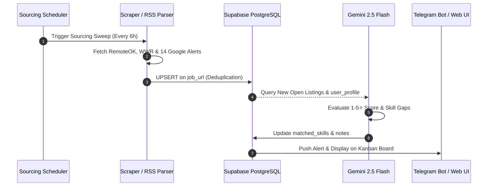
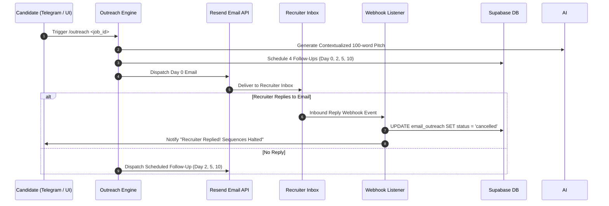

# 🗺️ Path Pilot — System Component Map & Architecture Specification

## 1. Executive Summary
This document outlines the detailed component architecture, data flow pipelines, integration interfaces, and deployment topologies for the **Path Pilot** autonomous DevOps career sourcing and international MSc scholarship platform.

---

## 2. Component Hierarchy Map

```
Path Pilot Ecosystem
├── 1. Ingestion & Scraping Layer
│   ├── RemoteOK API Worker (JSON Client)
│   ├── WeWorkRemotely RSS Scraper
│   ├── Multi-Feed Google Alerts RSS Parser (14+ Feeds)
│   └── Dead Board Liveness Prober (HTTP HEAD/GET)
│
├── 2. Persistence & Storage Layer (Supabase PostgreSQL)
│   ├── Career Relational Tables (jobs, job_applications, contacts, email_outreach)
│   ├── Academic Relational Tables (programmes, scholarships, scholarship_applications)
│   ├── Unified State Tables (tasks, metrics, user_profile)
│   └── Connection Pooler (Supavisor Session Mode :5432)
│
├── 3. AI Orchestration & Evaluation Engine (Gemini 2.5 Flash)
│   ├── Match Scoring & Skill Gap Matrix Evaluator
│   ├── Zero-Hallucination CV Tailoring Engine (Grounded Prompting)
│   ├── STAR Method Behavioral Story Generator
│   ├── Portal Application Question Answer Assistant
│   └── Academic Statement of Purpose (SOP) Style-Transfer Generator
│
├── 4. Outreach & Delivery Engine
│   ├── Recruiter Lead Discovery Service
│   ├── 4-Stage Email Cadence Scheduler (Day 0, 2, 5, 10)
│   ├── Resend Transactional Email Dispatcher (therook.xyz DKIM/SPF)
│   └── Webhook Callback Receiver (Auto-Cancellation on Reply)
│
├── 5. Multi-Interface Synchronization Layer
│   ├── Telegraf Mobile Telegram Bot (16 Commands)
│   ├── Single-Page Responsive Kanban Dashboard (Port 8080)
│   └── Self-Hosted n8n Engine (4-Branch Google Sheets Sync :5678)
│
└── 6. Infrastructure & CI/CD Layer
    ├── Docker Compose Multi-Container Orchestration
    ├── Nginx Reverse Proxy & SSL Termination (Certbot / Let's Encrypt)
    └── GitHub Actions Automated SSH Deployment Pipeline
```

---

## 3. Data Flow & Sequence Diagrams

### 3.1 Opportunity Sourcing & AI Scoring Flow


### 3.2 4-Stage Cold Outreach Sequence with Webhook Safety


---

## 4. Architectural Decisions & Trade-Offs (ADRs)

### ADR-001: Supavisor Session Pooler over Transaction Mode
* **Context**: n8n and Node.js require stable prepared statements for recurring SQL executions.
* **Decision**: Configured Supabase connection pooler in **Session Mode (Port 5432)** instead of Transaction Mode (Port 6543).
* **Consequences**: Zero prepared statement invalidation errors across long-running Docker containers.

### ADR-002: Google Alerts RSS Feeds for Cloudflare-Protected Boards
* **Context**: Scraping Indeed, Glassdoor, and LinkedIn directly triggers aggressive IP blocks and Cloudflare CAPTCHAs.
* **Decision**: Ingest Google Alerts RSS feeds where Google's crawlers handle the indexing and deliver clean XML streams.
* **Consequences**: $0 proxy cost and 100% scraper reliability without CAPTCHA solver dependencies.

### ADR-003: Grounded Few-Shot Prompting for 0% Hallucination
* **Context**: LLMs tend to fabricate previous employment dates, metrics, and technologies when tailoring resumes.
* **Decision**: Implemented an immutable grounding framework where the system prompt explicitly forbids adding facts not present in `user_profile.raw_resume_text`.
* **Consequences**: Verified authentic resumes with 0% risk of fabricated qualifications.

---

## 5. Deployment & Topology Specification

| Container Name | Base Image | Exposed Port | Bound Address | Purpose |
| :--- | :--- | :--- | :--- | :--- |
| `pipeline_bot` | `node:22-alpine` | - | Internal | Telegraf Telegram Bot & Background Schedulers |
| `pipeline_dashboard`| `nginx:alpine` | 80 | `127.0.0.1:8080` | Single-Page Application Kanban UI |
| `n8n_pipeline` | `n8nio/n8n:latest` | 5678 | `127.0.0.1:5678` | 4-Branch Google Sheets Live Sync Engine |

*Host Nginx on Contabo VPS proxies HTTPS traffic via Let's Encrypt to `127.0.0.1:8080` (`pipeline.therook.xyz`) and `127.0.0.1:5678` (`n8n.therook.xyz`).*
