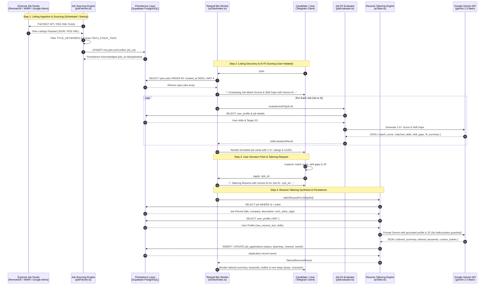

# 🔄 Path Pilot — Career Data Flow Walkthrough
## Sourcing Jobs and Tailoring Applications

## 1. Overview & Architectural Scope
This document provides an end-to-end, motion-level trace of a job listing's complete lifecycle within the **Path Pilot** career pipeline. It follows a single job opportunity from its arrival at an external provider through ingestion, database persistence, candidate discovery, AI fit scoring, the user's decision gate, and automated resume tailoring.

All components, database tables, and interfaces referenced herein align with the system boundaries established in [`docs/COMPONENT_MAP.md`](./COMPONENT_MAP.md).

---

## 2. End-to-End Sequence Diagram



---

## 3. Detailed Step-by-Step Data Flow

### Step 1: Listing Arrival & Ingestion
* **Trigger Type**: Scheduled background interval (every 6 hours via `setInterval`), initial startup sweep (5s delay), or user-initiated via `/fetch_jobs`.
* **Executing Component**: `Job Sourcing Engine` (`src/services/jobFetcher.ts`).
* **Input Data Received**:
  * **RemoteOK API**: HTTP GET `https://remoteok.com/api` (JSON array of job objects with fields `position`, `company`, `location`, `tags`, `url`, `date`, `description`).
  * **WeWorkRemotely RSS**: HTTP GET `https://weworkremotely.com/categories/remote-devops-sysadmin-jobs.rss` (XML feed with `title`, `link`, `content`, `pubDate`).
  * **Google Alerts RSS**: XML feeds configured in `config/google_alerts.txt` or `GOOGLE_ALERTS_RSS_URLS` environment variable.
* **Internal Processing**:
  1. Filters raw titles and descriptions against `TITLE_KEYWORDS`:
     ```typescript
     ['devops', 'cloud', 'sre', 'site reliability', 'platform', 'devsecops', 'infrastructure', 'security engineer', 'systems engineer', 'kubernetes', 'scholarship', 'masters']
     ```
  2. Extracts matching technology tags against canonical `TECH_STACK_TAGS` (`Kubernetes`, `Docker`, `Terraform`, `AWS`, `GCP`, `CI/CD`, etc.).
  3. Maps results into standardized `Job` payloads with `status: 'open'` and `is_remote: true`.
* **Output Data Passed**:
  * Array of `Partial<Job>` records passed to `supabase.from('jobs').upsert(..., { onConflict: 'job_url' })`.
* **Persistence & Schema Mutation**:
  * Inserts new listings or updates timestamps on existing listings in the `jobs` table:
    * `id` (UUID generated by PostgreSQL)
    * `title` (VARCHAR)
    * `company` (VARCHAR)
    * `location` (VARCHAR)
    * `is_remote` (BOOLEAN)
    * `tech_stack_tags` (TEXT[])
    * `source` ('RemoteOK' | 'WeWorkRemotely' | 'Google Alerts')
    * `job_url` (TEXT, UNIQUE constraint)
    * `description` (TEXT)
    * `posted_date` (TIMESTAMPTZ)
    * `status` ('open')
    * `updated_at` (TIMESTAMPTZ)

---

### Step 2: Listing Discovery & Fit Evaluation
* **Trigger Type**: User-initiated on-demand.
* **Executing Component**: `Telegraf Telegram Bot Worker` (`src/bot/index.ts:151-198`) & `Job Fit Evaluator` (`src/services/jobEvaluator.ts`).
* **Input Data Received**:
  * Telegram slash command: `/jobs`.
  * Candidate identity verified by middleware (`TELEGRAM_ALLOWED_USER_ID`).
* **Internal Processing**:
  1. Queries the database for the 4 most recent open listings:
     ```typescript
     supabase.from('jobs').select('*').eq('status', 'open').order('created_at', { ascending: false }).limit(4)
     ```
  2. For each job record, invokes `evaluateJobFit(job.id)`:
     * Reads canonical candidate skills from `user_profile` table (defaults to `['Kubernetes', 'Docker', 'Terraform', 'AWS', 'GCP', 'Node.js', 'CI/CD', 'Python']` if unpopulated).
     * Sends structured prompt to `gemini-1.5-flash` with candidate profile and target job description.
     * Evaluates skill overlap, identifies missing technologies (`skill_gaps`), and assigns a 1–5 integer score (`match_score`).
* **Output Data Passed**:
  * `JobEvaluationResult` object:
    ```json
    {
      "match_score": 5,
      "matched_skills": ["Kubernetes", "Docker", "Terraform", "AWS", "CI/CD"],
      "skill_gaps": ["ArgoCD"],
      "red_flags": [],
      "fit_summary": "Strong alignment on core DevOps & Cloud infrastructure stack."
    }
    ```
* **User-Facing Presentation**:
  * Bot sends an initial status notification: `"🧠 Evaluating Job Match Scores & Skill Gaps with Gemini AI..."`.
  * Followed by formatted Markdown cards:
    ```text
    🚀 Latest Jobs with AI Match Scores

    1. Senior Cloud Platform Engineer @ Canva
     Match Score: ⭐⭐⭐⭐⭐
    📍 Sydney, Australia (Remote)
    ✅ Matched: `Kubernetes, Docker, Terraform, AWS, CI/CD`
    ⚠️ Skill Gap: `ArgoCD`
    🆔 ID: `7b29e01f-0e44-4822-b5e2-628d61394f71`
    🔗 Apply Link: https://example.com/jobs/canva-sre
    ```

---

### Step 3: Candidate Decision Gate & Tailoring Invocation
* **Trigger Type**: User Decision Gate.
* **Executing Component**: Candidate / User (Telegram Client).
* **The Decision Point**:
  * The candidate reviews the 4 surfaced listings, weighs their match scores (e.g. ⭐⭐⭐⭐⭐ vs ⭐⭐⭐), inspects the identified `skill_gaps`, and selects the target role they wish to pursue.
  * The user copies the job's unique UUID (`<job_id>`) from the `/jobs` output.
* **Input Data Sent by User**:
  * Command message: `/apply 7b29e01f-0e44-4822-b5e2-628d61394f71`
* **Bot Validation & Acknowledgement**:
  * Validates that `jobId` argument is present (if missing, sends usage guide).
  * Sends immediate acknowledgement message:
    `"🧠 Tailoring Resume with Gemini AI for Job ID: 7b29e01f-0e44-4822-b5e2-628d61394f71..."`

---

### Step 4: Resume Tailoring Synthesis & State Persistence
* **Trigger Type**: Synchronous execution triggered by `/apply <job_id>`.
* **Executing Component**: `Resume Tailoring Engine` (`src/services/aiTailor.ts`) & `Persistence Layer` (`supabase/schema.sql`).
* **Input Data Received by `tailorResumeForJob(jobId)`**:
  1. `jobId`: String UUID.
  2. Queries `jobs` table: `SELECT * FROM jobs WHERE id = jobId`.
  3. Queries `user_profile` table: `SELECT * FROM user_profile LIMIT 1` (extracts `raw_resume_text`).
* **AI Orchestration & Guardrails**:
  * Invokes `GoogleGenerativeAI` (`gemini-1.5-flash`) with prompt guardrails:
    > *"STRICT GUARDRAIL: Do NOT fabricate, invent, or hallucinate companies, degrees, dates, or unearned certifications. You may ONLY re-word, re-prioritize, and highlight relevant matching skills."*
  * Generates tailored profile content structured as JSON:
    ```json
    {
      "tailored_summary": "DevOps Engineer with 4+ years architecting Kubernetes and AWS cloud infrastructure. Proven track record reducing deployment cycles by 40% using Terraform and CI/CD pipelines.",
      "tailored_keywords": ["Kubernetes", "AWS", "Terraform", "Docker", "CI/CD", "DevSecOps", "Helm", "Prometheus", "Grafana", "Linux"],
      "custom_bullets": [
        "Architected multi-region Kubernetes clusters on AWS supporting high-throughput microservices.",
        "Automated Terraform infrastructure provisioning reducing deployment lead time by 40%.",
        "Enforced DevSecOps automated container vulnerability scanning across production deployment pipelines."
      ]
    }
    ```
* **Persistence & Schema Mutation**:
  * Writes to `job_applications` table via `saveTailoredApplication(jobId, result)`:
    * `id` (UUID generated by PostgreSQL)
    * `job_id` (`7b29e01f-0e44-4822-b5e2-628d61394f71`, foreign key referencing `jobs.id`)
    * `status` (**`'planning'`**)
    * `tailored_summary` (TEXT)
    * `tailored_keywords` (TEXT[])
    * `custom_bullets` (TEXT[])
    * `application_channel` (**`'portal'`**)
    * `date_applied` (TIMESTAMPTZ `new Date().toISOString()`)
* **Output Data Passed to User**:
  * The bot formats and renders the tailored resume result to Telegram:
    ```text
    ✅ Resume Tailored Successfully!

    📝 Summary Profile:
    DevOps Engineer with 4+ years architecting Kubernetes and AWS cloud infrastructure. Proven track record reducing deployment cycles by 40% using Terraform and CI/CD pipelines.

    🔑 Matched Keywords:
    `Kubernetes, AWS, Terraform, Docker, CI/CD, DevSecOps, Helm, Prometheus, Grafana, Linux`

    🎯 Key Custom Bullet Points:
    • Architected multi-region Kubernetes clusters on AWS supporting high-throughput microservices.
    • Automated Terraform infrastructure provisioning reducing deployment lead time by 40%.
    • Enforced DevSecOps automated container vulnerability scanning across production deployment pipelines.

    💡 Use /prep 7b29e01f-0e44-4822-b5e2-628d61394f71 for STAR interview prep, or /outreach 7b29e01f-0e44-4822-b5e2-628d61394f71 to draft cold outreach.
    ```

---

## 4. Failure Modes, Edge Cases & Verbatim System Replies

The table below documents every potential failure mode across the sourcing and tailoring journey, the executing component that handles it, and the exact response dispatched by the system:

| Scenario / Failure Condition | Triggering Step | Handling Mechanism & Fallback | Verbatim Telegram / Console Reply |
| :--- | :--- | :--- | :--- |
| **Missing Command Argument** | Candidate types `/apply` without a job UUID. | `src/bot/index.ts:205-207` validates argument presence. Aborts execution before querying database. | `⚠️ Usage: /apply <job_id>` |
| **Non-Existent Job ID** | Candidate supplies invalid UUID or deleted ID: `/apply 00000000-0000-0000-0000-000000000000`. | `src/services/aiTailor.ts:34-36` queries `jobs` table; throws `Error("Job with ID <id> not found.")`. Caught by `/apply` handler. | `⚠️ Error tailoring resume: Job with ID 00000000-0000-0000-0000-000000000000 not found.` |
| **No Open Jobs in Database** | Candidate executes `/jobs` before initial sourcing sweep completes. | `src/bot/index.ts:163-165` detects empty array from `jobs` query and prompts manual fetch. | `📭 No open jobs found in database yet. Use /fetch_jobs to trigger a sourcing sweep!` |
| **Missing `GEMINI_API_KEY`** | Application runs without AI credentials configured in `.env`. | `aiTailor.ts:44-58` detects `!genAI`. Generates deterministic mock summary, keywords from `job.tech_stack_tags`, and 3 static bullets; persists application with `status: 'planning'`. | `✅ Resume Tailored Successfully!` *(Delivers deterministic mock bullets; logs `⚠️ GEMINI_API_KEY missing. Returning mock tailored resume output.` to console)* |
| **Gemini AI API Runtime Error** | Gemini rate limit, quota exhaustion, or malformed JSON generation. | `aiTailor.ts:98-101` catches error, logs to console, and rethrows `error`. `src/bot/index.ts:223-225` catches exception and formats message. | `⚠️ Error tailoring resume: <error_message>` |
| **External RSS Feed Down / Timeout** | WeWorkRemotely or Google Alerts feed experiences network failure. | `jobFetcher.ts:176-203` wraps feed fetching in `Promise.allSettled`. Failed feeds log error to console; healthy feeds proceed. | Sweep succeeds with available listings; console logs: `⚠️ Error fetching Google Alert feed (<url>): <error_message>` |
| **Database Connection Unreachable** | Supabase outage or invalid database service key. | `src/bot/index.ts:194-197` catches database rejection during `/jobs` query. | `⚠️ Failed to query jobs table.` |

---

## 5. Summary Data Contract Matrix

| Stage | Producer Component | Consumer Component | Input Data Contract | Output Data Contract |
| :--- | :--- | :--- | :--- | :--- |
| **1. Sourcing** | External Feeds (RemoteOK, WWR, RSS) | `jobFetcher.ts` | Raw REST JSON / XML RSS streams | `jobs` table record (`status: 'open'`, `tech_stack_tags: string[]`) |
| **2. Fit Scoring** | `jobs` table & `user_profile` | `jobEvaluator.ts` | `jobId`, `userProfile.raw_resume_text` | `JobEvaluationResult` (`match_score: 1-5`, `matched_skills`, `skill_gaps`) |
| **3. Decision** | `/jobs` Telegram output | Candidate (Telegram User) | 4 formatted job cards with UUIDs & match stars | `/apply <job_id>` command |
| **4. Tailoring** | `aiTailor.ts` & `gemini-1.5-flash` | `job_applications` table & User | Target `job` record & canonical `user_profile` | `job_applications` record (`status: 'planning'`, `custom_bullets`) & Telegram markdown delivery |
