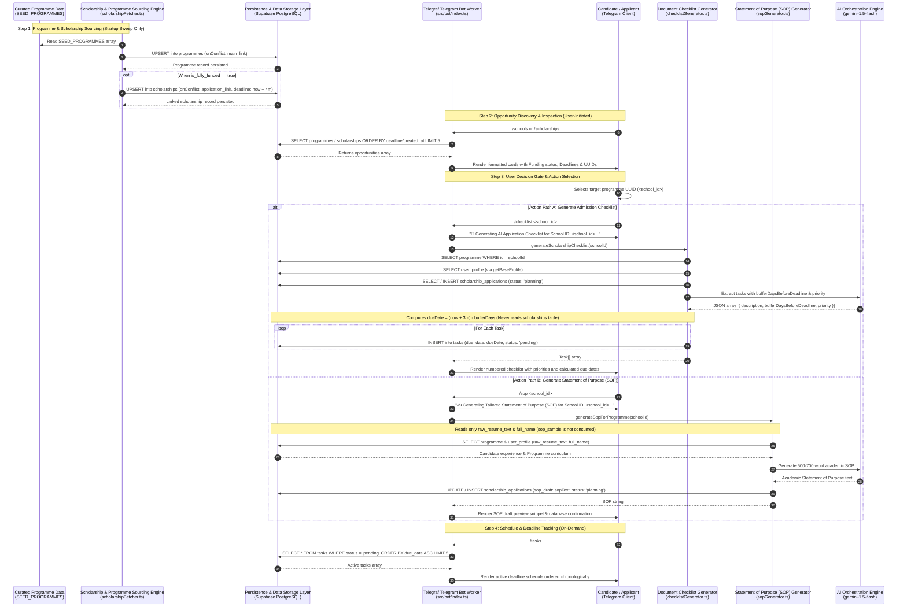

# 🎓 Path Pilot — Scholarship & MSc Tracker Data Flow Walkthrough
## Tracking Scholarships, Generating Checklists, and Drafting Statements of Purpose (CA-003)

## 1. Overview & Architectural Scope
This document defines the complete end-to-end data flow for the **Scholarship and MSc Programme Tracker** within Path Pilot. 

Unlike the career pipeline—which operates on high-frequency scraping of fast-decaying job listings—the scholarship pipeline operates on a **curated seasonal intake and deadline-driven pattern**:
1. **Fixed-Horizon Intake**: Seeded university programmes and linked scholarship opportunities with static application deadlines.
2. **Reverse Deadline Scheduling**: Admission tasks are scheduled backwards against an internal baseline (`now + 3 months`) using extracted buffer days.
3. **Application State & Asset Tracking**: Generates structured document checklists in `tasks` and customized Statement of Purpose (SOP) drafts in `scholarship_applications`.

All components, database schemas, and service contracts align strictly with [`docs/COMPONENT_MAP.md`](./COMPONENT_MAP.md).

---

## 2. End-to-End Sequence Diagram



---

## 3. Detailed Step-by-Step Data Flow

### Step 1: Programme & Scholarship Sourcing
* **Trigger Type**: Executed **strictly once automatically at container startup** (with a 5-second initial delay) via `runScholarshipSourcingPipeline()`. 
  > *Implementation Note*: While `/fetch_schools` is advertised in the bot's `/help` menu, it has **no registered `bot.command('fetch_schools')` handler** in `src/bot/index.ts` and cannot be triggered on demand via slash command.
* **Executing Component**: `Scholarship & Programme Sourcing Engine` (`src/services/scholarshipFetcher.ts`).
* **Input Data**:
  * `SEED_PROGRAMMES` hardcoded array containing European MSc opportunities (e.g., SECCLO Erasmus Mundus, TU Delft Cloud Computing, KTH Cybersecurity, DAAD Germany).
* **Internal Processing**:
  1. Iterates over seed items and executes `UPSERT` on the `programmes` table using `onConflict: 'main_link'`.
  2. For fully funded programmes (`is_fully_funded: true`), dynamically computes a target application deadline of **`now + 4 months`** (`deadlineDate.setMonth(now.getMonth() + 4)`).
  3. Upserts linked scholarship records into the `scholarships` table using `onConflict: 'application_link'`.
* **Database Mutations**:
  * **`programmes`**: `name`, `university`, `country`, `field`, `degree_level`, `tuition_fee`, `is_fully_funded`, `duration`, `main_link`, `notes`.
  * **`scholarships`**: `programme_id`, `name`, `provider`, `country`, `coverage`, `eligibility_summary`, `deadline`, `application_link`, `tags`.
* **Output / Logging**:
  * Logs to console: `✅ School Sourcing Complete: <N> programmes, <M> scholarships stored.`
  * Returns `{ programmesCount: number, scholarshipsCount: number }`.

---

### Step 2: Opportunity Discovery & Inspection
* **Trigger Type**: User-initiated on-demand via Telegram slash commands.
* **Executing Component**: `Telegraf Telegram Bot Worker` (`src/bot/index.ts:325-384`).
* **User Commands**:
  1. `/schools`: Queries `programmes` table (`order('created_at', { ascending: false }).limit(5)`).
  2. `/scholarships`: Queries `scholarships` table (`order('deadline', { ascending: true }).limit(5)`).
* **User-Facing Presentation**:
  * `/schools` renders tracked MSc programmes:
    ```text
    🎓 MSc Programmes Tracked

    1. SECCLO - Erasmus Mundus Master in Security and Cloud Computing
    🏛 Aalto University & KTH Royal Institute of Technology (Finland & Sweden)
    💰 Funding: Fully Funded
    🆔 ID: `4f3e2b1a-9c8d-4e7f-b2a1-0e9d8c7b6a5f`
    🔗 [Programme Link](https://secclo.aalto.fi/)
    ```
  * `/scholarships` renders fully funded scholarship deadlines (displaying the `now + 4 months` deadline from `scholarships.deadline`):
    ```text
    🏆 Fully-Funded Scholarships

    1. SECCLO - Erasmus Mundus Master in Security and Cloud Computing Scholarship
    🏛 Provider: Aalto University & KTH (Finland & Sweden)
    💰 Coverage: Full Tuition + Monthly Stipend (€900 - €1,400) + Travel
    📅 Deadline: 1/20/2027
    🆔 ID: `8a7b6c5d-4e3f-2a1b-0c9d-8e7f6a5b4c3d`
    ```

---

### Step 3: Candidate Decision Gate & Action Invocation
* **The Decision Point**:
  * The candidate reviews the surfaced programmes or scholarships, selects a target institution, and copies the UUID (`<school_id>`).
  * The candidate can trigger three distinct action paths / user commands:
    1. **Checklist Generation**: `/checklist <school_id>` to convert admission criteria into scheduled tasks.
    2. **SOP Generation**: `/sop <school_id>` to synthesize a university-specific Statement of Purpose.
    3. **Tone Calibration**: `/sop_sample <text>` to save custom writing style samples in `user_profile.parsed_json.sop_sample`. *(Note: Saved to database, but not currently read by `sopGenerator.ts`)*.

---

### Step 4: Checklist Generation & Reverse Deadline Scheduling
* **Trigger Type**: User-initiated via `/checklist <school_id>`.
* **Executing Component**: `Document Checklist Generator` (`src/services/checklistGenerator.ts`) & `Persistence & Data Storage Layer`.
* **Input Data Received & Database Queries**:
  1. `schoolId`: String UUID from command parameter.
  2. Queries `programmes` table: `SELECT * FROM programmes WHERE id = schoolId`.
  3. Queries `user_profile` table via `getBaseProfile()`: `SELECT * FROM user_profile LIMIT 1`.
  4. Queries `scholarship_applications` table: `SELECT id FROM scholarship_applications WHERE programme_id = schoolId`.
* **Internal Processing & Application Record**:
  1. Checks for existing record in `scholarship_applications` table where `programme_id = schoolId`.
  2. **Conditional Insert Only (No Updates)**: If no record exists, inserts an initial planning record:
     ```typescript
     supabase.from('scholarship_applications').insert({
       programme_id: schoolId,
       status: 'planning',
       date_started: new Date().toISOString()
     })
     ```
     > *Architectural Contract*: `checklistGenerator.ts:30-38` performs **only a `SELECT id` and a conditional `INSERT`** when no record exists. It **never issues an `UPDATE`** against `scholarship_applications` (the only component that executes an `UPDATE` on `scholarship_applications` is `sopGenerator.ts:saveSopDraft` when persisting drafted SOP text). Subsequent `/checklist` invocations for the same school leave the existing application row untouched and insert a fresh batch of pending tasks linked to that application ID.
  3. **Baseline Deadline Derivation & Decoupling**:
     * `checklistGenerator.ts:40-41` instantiates its own internal baseline deadline:
       ```typescript
       const targetDeadline = new Date();
       targetDeadline.setMonth(targetDeadline.getMonth() + 3); // 90 days default buffer
       ```
     * **Architectural Trace & Verification of Negative Boundary**:
       * The generator queries `programmes`, calls `getBaseProfile()` to query `user_profile`, and queries/inserts into `scholarship_applications`.
       * However, `checklistGenerator.ts` **never queries or reads the `scholarships` table**. Consequently, the `scholarships.deadline` (`now + 4 months`) displayed in `/scholarships` cannot reach the due date calculations. Task due dates are calculated completely independently against the internal `now + 3 months` baseline.
* **AI Extraction (`gemini-1.5-flash`)**:
  * Sends structured prompt with programme curriculum, university details, and funding status.
  * Requests JSON array of tasks with `bufferDaysBeforeDeadline` and `priority`:
    ```json
    [
      { "description": "Draft & refine Statement of Purpose (SOP) for SECCLO", "bufferDaysBeforeDeadline": 45, "priority": "urgent" },
      { "description": "Request Academic Recommendation Letters from 2 Professors", "bufferDaysBeforeDeadline": 40, "priority": "high" },
      { "description": "Order & Apostille official University Transcripts & Degree Certificate", "bufferDaysBeforeDeadline": 35, "priority": "high" },
      { "description": "Book & take IELTS Academic English Test (Target: 7.0+)", "bufferDaysBeforeDeadline": 30, "priority": "medium" },
      { "description": "Format DevOps CV into Europass / Academic Format", "bufferDaysBeforeDeadline": 20, "priority": "medium" },
      { "description": "Submit online application portal form for Aalto University", "bufferDaysBeforeDeadline": 7, "priority": "urgent" }
    ]
    ```
* **Reverse Due Date Calculation & Persistence**:
  * For each task item, computes:
    $$\text{dueDate} = (\text{now} + 3\text{ months}) - \text{bufferDaysBeforeDeadline}$$
  * Inserts record into `tasks` table:
    * `entity_type`: `'scholarship'`
    * `entity_id`: `scholarship_applications.id` (or `programmeId`)
    * `description`: `item.description`
    * `due_date`: `dueDate.toISOString()`
    * `status`: `'pending'`
    * `priority`: `item.priority`
* **User-Facing Delivery**:
  * Telegram bot renders the generated tasks list with priority badges and due dates, prompting the user to view their active schedule with `/tasks`.

---

### Step 5: Statement of Purpose (SOP) Synthesis & Persistence
* **Trigger Type**: User-initiated via `/sop <school_id>`.
* **Executing Component**: `Statement of Purpose (SOP) Generator` (`src/services/sopGenerator.ts`) & `Persistence & Data Storage Layer`.
* **Input Data Received**:
  1. `schoolId`: String UUID.
  2. Queries `programmes` table for target university, country, degree level, and field.
  3. Queries `user_profile` table for `candidateName` (`user_profile.full_name`) and `rawProfile` (`user_profile.raw_resume_text`).
  > *Architectural Note*: While `/sop_sample <text>` updates `user_profile.parsed_json.sop_sample`, `sopGenerator.ts:20-23` reads only `full_name` and `raw_resume_text`. The `parsed_json.sop_sample` field is **not consumed** by the prompt generator.
* **AI Orchestration & Prompt Guardrails**:
  * Prompts `gemini-1.5-flash` to author a 500–700 word academic SOP following a 5-stage structure:
    1. *Introduction & Hook*: Expressing passion for the specific university and degree.
    2. *Technical Background*: Linking candidate's DevOps, Kubernetes, and Cloud experience to academic readiness.
    3. *Curriculum Alignment*: Citing specific labs, coursework, and research focus in the target field.
    4. *Future Career Trajectory*: Outlining long-term goals in Cloud Architecture and Security leadership.
    5. *Tone*: Formal, scholarly, ambitious, and authentic.
* **State Persistence**:
  * Saves complete drafted essay to `scholarship_applications` table:
    * If record exists for `programme_id`: `UPDATE scholarship_applications SET sop_draft = sopText WHERE id = existing.id` (`sopGenerator.ts:80-83`).
    * If new: `INSERT INTO scholarship_applications (programme_id, status, sop_draft, date_started) VALUES (programmeId, 'planning', sopText, now())` (`sopGenerator.ts:85-90`).
* **User-Facing Delivery**:
  * Bot delivers a formatted message containing the first 800 characters of the drafted SOP, confirming full persistence under the `scholarship_applications` record.

---

### Step 6: Task Schedule & Deadline Tracking
* **Trigger Type**: User-initiated on-demand via `/tasks`.
* **Executing Component**: `Telegraf Telegram Bot Worker` (`src/bot/index.ts:440-466`).
* **Database Query**:
  ```typescript
  supabase.from('tasks').select('*').eq('status', 'pending').order('due_date', { ascending: true }).limit(5)
  ```
* **User-Facing Output**:
  ```text
  📅 Active Application Tasks

  1. [URGENT] Draft & refine Statement of Purpose (SOP) for SECCLO
     📅 Due Date: 11/5/2026

  2. [HIGH] Request Academic Recommendation Letters from 2 Professors
     📅 Due Date: 11/10/2026

  3. [HIGH] Order & Apostille official University Transcripts & Degree Certificate
     📅 Due Date: 11/15/2026
  ```

---

## 4. Failure Modes, Edge Cases & Verbatim System Replies

The table below catalogs every potential failure mode across the scholarship lifecycle, detailing the handling mechanism and exact system outputs:

| Scenario / Failure Condition | Triggering Step | Handling Mechanism & Fallback | Verbatim Telegram / Console Reply |
| :--- | :--- | :--- | :--- |
| **Missing Command Argument** | Candidate sends `/checklist` or `/sop` without a UUID. | `src/bot/index.ts:391-393` and `419-421` validate argument presence before querying database. | `⚠️ Usage: /checklist <school_id>`<br>`⚠️ Usage: /sop <school_id>` |
| **Non-Existent School ID** | Candidate supplies invalid or non-existent UUID to either `/checklist <invalid_id>` or `/sop <invalid_id>`. | `checklistGenerator.ts:23-25` (`/checklist`) and `sopGenerator.ts:16-18` (`/sop`) query the `programmes` table; both throw `Error("Programme with ID <id> not found.")`. Command handlers in `src/bot/index.ts:408-411` and `433-436` catch the exception and format user-facing alerts. | `⚠️ Error generating checklist: Programme with ID 00000000-0000-0000-0000-000000000000 not found.`<br>`⚠️ Error generating SOP: Programme with ID 00000000-0000-0000-0000-000000000000 not found.` |
| **Empty Database Tables** | Candidate executes `/schools` or `/scholarships` before startup seed runs. | `src/bot/index.ts:335-337` and `366-368` check for empty query arrays and return guidance. | `📭 No MSc programmes stored in database yet. Use /fetch_schools to load opportunities!`<br>`📭 No scholarships found in database yet. Use /fetch_schools to populate!` |
| **No Pending Tasks Due** | Candidate executes `/tasks` when all tasks are complete or none exist. | `src/bot/index.ts:451-453` checks `tasks` query count. | `🎉 No pending tasks due! You are all caught up.` |
| **Missing `GEMINI_API_KEY` (Checklist)** | Checklist generated without Gemini API credentials configured. | `checklistGenerator.ts:45-54` detects `!genAI` and falls back to a deterministic 6-task standard checklist (SOP [45d, urgent], Reference Letters [40d, high], Transcripts [35d, high], IELTS [30d, medium], Europass CV [20d, medium], Portal Form [7d, urgent]). | Renders standard 6-task checklist with calculated due dates; saves items to `tasks` table with `status: 'pending'`. |
| **Missing `GEMINI_API_KEY` (SOP)** | SOP requested without Gemini API credentials configured. | `sopGenerator.ts:24-36` detects `!genAI` and synthesizes a structured template SOP referencing candidate name, programme, university, and field; persists draft to `scholarship_applications`. | `📜 Statement of Purpose (SOP) Draft Created!` *(Delivers structured template SOP and saves to database)* |
| **Gemini AI API Runtime Error (Checklist)** | Gemini rate limit, quota exhaustion, or invalid JSON response. | `checklistGenerator.ts:84-90` catches error, logs warning to console, and falls back to a 2-task array (Draft SOP [30d, urgent], Recommendation letters [25d, high]), persisting tasks to `tasks`. | Generates 2 fallback tasks and renders confirmation without crashing. Console logs: `⚠️ Gemini Checklist extraction error: <message>`. |
| **Gemini AI API Runtime Error (SOP)** | Gemini rate limit, quota exhaustion, or network disconnect. | `sopGenerator.ts:68-71` catches error, logs to console, and rethrows `err`. `src/bot/index.ts:434-436` catches exception and formats message. | `⚠️ Error generating SOP: <error_message>` |
| **Database Upsert Failure on Sourcing** | Supabase connection issue during startup seeding. | `scholarshipFetcher.ts:84` suppresses individual record insert errors and skips incrementing counters. Startup `.catch()` in `src/bot/index.ts:560` logs error to console. | Console logs: `Initial school fetch error: <error_message>`. No user-facing bot alert dispatched. |

---

## 5. Summary Data Contract Matrix

| Stage | Producer Component | Consumer Component | Input Data Contract | Output Data Contract |
| :--- | :--- | :--- | :--- | :--- |
| **1. Seed & Sourcing** | `SEED_PROGRAMMES` constant | `Scholarship & Programme Sourcing Engine` (`scholarshipFetcher.ts`) | Hardcoded array of European MSc opportunities | `programmes` records (`onConflict: 'main_link'`) & `scholarships` records (`onConflict: 'application_link'`, `deadline = now + 4m`) |
| **2. Discovery** | `Persistence & Data Storage Layer` (`programmes` & `scholarships` tables) | Candidate (Telegram User) | User commands `/schools` or `/scholarships` | Formatted opportunity cards with funding status, deadlines (`now + 4m`), and UUIDs |
| **3. Decision** | Discovery card outputs | Candidate (Telegram User) | Target `school_id` UUID | `/checklist <school_id>`, `/sop <school_id>`, or `/sop_sample <text>` |
| **4. Checklist Engine** | `Document Checklist Generator` (`checklistGenerator.ts`) & `AI Orchestration Engine` (`gemini-1.5-flash`) | `Persistence & Data Storage Layer` (`tasks` & `scholarship_applications` tables) | Target `programme` record, `user_profile` (via `getBaseProfile`), and `scholarship_applications` (independent baseline: `now + 3m`) | `scholarship_applications` record (`status: 'planning'`) and multiple `tasks` records with calculated `due_date = (now + 3m) - bufferDays` |
| **5. SOP Engine** | `Statement of Purpose (SOP) Generator` (`sopGenerator.ts`) & `AI Orchestration Engine` (`gemini-1.5-flash`) | `Persistence & Data Storage Layer` (`scholarship_applications` table) & User | Target `programme` record & `user_profile` (`full_name`, `raw_resume_text`) | `scholarship_applications.sop_draft` (500–700 word academic essay) and Telegram preview snippet |
| **6. Task Tracking** | `Persistence & Data Storage Layer` (`tasks` table) | Candidate (Telegram User) | `/tasks` command | 5 nearest pending tasks sorted chronologically by `due_date` |
