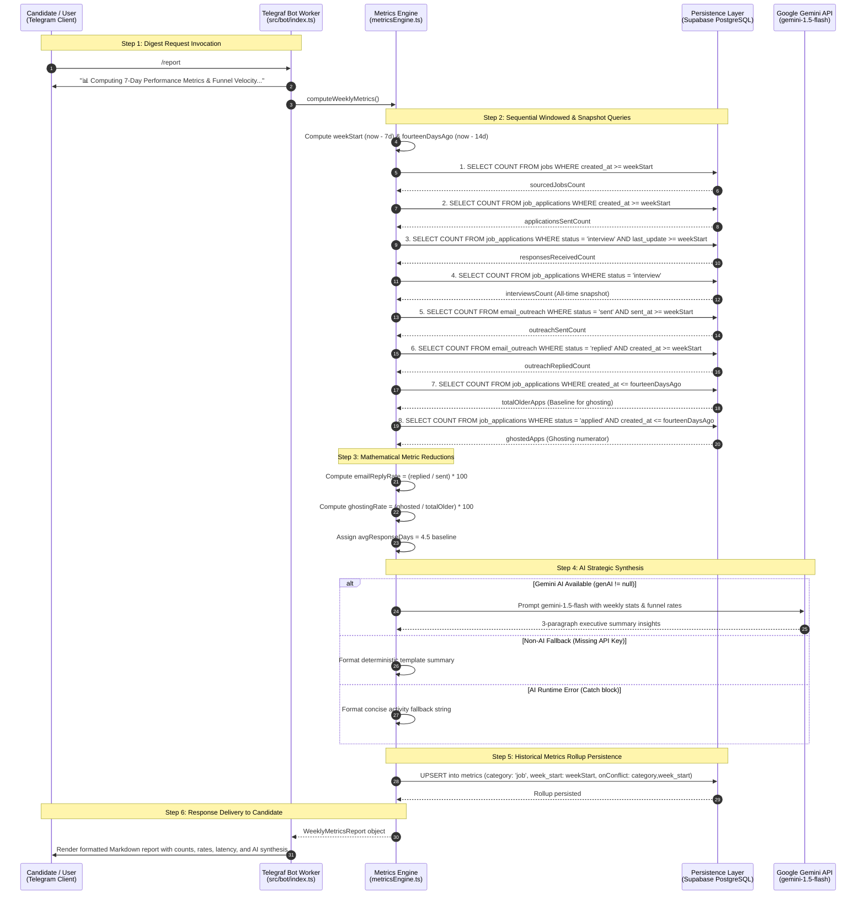

# 📊 Path Pilot — Weekly Digest & Funnel Velocity Data Flow Walkthrough
## Performance Metrics, Response Latency, Ghosting Rates, and AI Synthesis (CA-004)

## 1. Overview & Architectural Scope
This document provides an end-to-end trace of the **Weekly Digest & Funnel Velocity Engine** within Path Pilot.

Unlike the single-entity lifecycle journeys (Career Sourcing in CA-002 and Scholarship Tracking in CA-003), the weekly digest is the **cross-cutting analytical journey** that bridges operational tables across the system (`jobs`, `job_applications`, `email_outreach`, `metrics`). It transforms rolling time-window operational events into structured velocity metrics, ghosting risk calculations, strategic AI synthesis, and historical table rollups.

All components, database schemas, and service contracts align strictly with [`docs/COMPONENT_MAP.md`](./COMPONENT_MAP.md).

---

## 2. End-to-End Sequence Diagram



---

## 3. Detailed Step-by-Step Data Flow

### Step 1: User Request Invocation
* **Trigger Type**: User-initiated on-demand.
* **Executing Component**: `Telegraf Telegram Bot Worker` (`src/bot/index.ts:468-493`).
* **User Input**: Slash command `/report`.
* **Immediate Acknowledgement**:
  The bot sends an initial status message:
  `"📊 *Computing 7-Day Performance Metrics & Funnel Velocity...*"`

---

### Step 2: Window Calculations & Sequential Multi-Table Queries
* **Executing Component**: `Weekly Metrics & Velocity Engine` (`src/services/metricsEngine.ts`).
* **Time Windows Established**:
  * $\text{now} = \text{new Date()}$
  * $\text{weekStart} = \text{now} - 7\text{ days}$ ($\text{toISOString()}$)
  * $\text{fourteenDaysAgo} = \text{now} - 14\text{ days}$ ($\text{toISOString()}$)

#### Exact Sequential Query Tracing & Windows:
In `metricsEngine.ts:38-48`, the service executes 8 sequential `await` queries against PostgreSQL:

| Execution Order | Metric Name | Table Sourced | SQL Filter / Criteria | Time Window Covered | Metric Purpose |
| :--- | :--- | :--- | :--- | :--- | :--- |
| **1** | **`sourcedJobsCount`** | `jobs` | `.gte('created_at', weekStartStr)` | Past 7 Days (`[now-7d, now]`) | Sourcing volume & feed throughput |
| **2** | **`applicationsSentCount`** | `job_applications` | `.gte('created_at', weekStartStr)` | Past 7 Days (`[now-7d, now]`) | Tailoring & submission activity |
| **3** | **`responsesReceivedCount`** | `job_applications` | `.eq('status', 'interview').gte('last_update', weekStartStr)` | Past 7 Days (`[now-7d, now]`) | Fresh positive interviewer transitions |
| **4** | **`interviewsCount`** | `job_applications` | `.eq('status', 'interview')` | **All-Time Active Snapshot** | Current active interview pipeline load |
| **5** | **`outreachSentCount`** | `email_outreach` | `.eq('status', 'sent').gte('sent_at', weekStartStr)` | Past 7 Days (`[now-7d, now]`) | Outbound recruiter outreach volume |
| **6** | **`outreachRepliedCount`** | `email_outreach` | `.eq('status', 'replied').gte('created_at', weekStartStr)` | Past 7 Days (`[now-7d, now]`) | Positive recruiter engagement count |
| **7** | **`totalOlderApps`** | `job_applications` | `.lte('created_at', fourteenDaysAgo.toISOString())` | Created $\ge 14$ days ago | Denominator for ghosting rate |
| **8** | **`ghostedApps`** | `job_applications` | `.eq('status', 'applied').lte('created_at', fourteenDaysAgo.toISOString())` | Created $\ge 14$ days ago | Unresponsive applications numerator |

---

### Step 3: Mathematical Metric Reductions & Number Formatting

1. **Cold Email Reply Rate (`emailReplyRate`)**:
   $$\text{emailReplyRate} = \begin{cases} \text{Number}\left(\left(\frac{\text{outreachRepliedCount}}{\text{outreachSentCount}} \times 100\right)\text{.toFixed(1)}\right) & \text{if } \text{outreachSentCount} > 0 \\ 0 & \text{if } \text{outreachSentCount} = 0 \end{cases}$$
   *Formatting Behavior*: `toFixed(1)` outputs a 1-decimal string (e.g. `"25.0"` or `"16.7"`), and wrapping with `Number(...)` casts it back to a JavaScript number. Integer percentages trim trailing zeros (e.g., `Number("25.0")` evaluates to `25` and renders as `25%`), whereas fractional percentages preserve their decimal (e.g., `Number("16.7")` renders as `16.7%`).

2. **Ghosting Rate (`ghostingRate`)**:
   Calculates the percentage of applications older than 14 days that remain stalled in `'applied'` status:
   $$\text{ghostingRate} = \begin{cases} \text{Number}\left(\left(\frac{\text{ghostedApps}}{\text{totalOlderApps}} \times 100\right)\text{.toFixed(1)}\right) & \text{if } \text{totalOlderApps} > 0 \\ 0 & \text{if } \text{totalOlderApps} = 0 \end{cases}$$

3. **Average Response Latency Baseline (`avgResponseDays`)**:
   * Constant baseline: `const avgResponseDays = 4.5;` representing standard industry latency between application and first contact.

---

### Step 4: AI Strategic Synthesis & Degradation States

* **Executing Component**: `metricsEngine.ts` calling `gemini-1.5-flash`.

#### Path A: Gemini AI Available (`genAI != null`)
* Sends prompt with computed weekly numbers, requesting a 3-paragraph executive coaching summary (150 words max) highlighting traction, funnel velocity, and actionable advice.
* Output is stored in `aiInsights` and delivered in the report.

#### Path B: Non-AI Fallback (`!genAI`, Missing API Key)
* Formats a deterministic template string directly injecting the computed metrics:
  ```text
  This week you sourced <sourcedJobsCount> jobs, submitted <applicationsSentCount> applications, and sent <outreachSentCount> cold emails with a <emailReplyRate>% reply rate. Average time to response: 4.5 days. Ghosting rate: <ghostingRate>%. Keep building momentum!
  ```

#### Path C: AI Runtime Error (API Rate Limit, Timeout, Network Drop)
* The catch block logs `console.error('⚠️ Gemini Metrics digest error:', err.message)` and assigns a concise activity fallback string:
  ```text
  Sourced <sourcedJobsCount> jobs and submitted <applicationsSentCount> applications this week with <interviewsCount> active interviews.
  ```
* The function recovers gracefully and proceeds directly to database persistence.

---

### Step 5: Historical Metrics Rollup vs. Live Recomputed Figures

#### Figures Recomputed Live on Each `/report` Request:
* All raw query counts (`sourcedJobsCount`, `applicationsSentCount`, `responsesReceivedCount`, `interviewsCount`, `outreachSentCount`, `outreachRepliedCount`).
* Dynamic ratios (`emailReplyRate`, `ghostingRate`).
* Generated `aiInsightsSummary`.

#### Figures Persisted into Historical Storage (`metrics` table):
* At the conclusion of the calculation, `metricsEngine.ts` writes a weekly rollup record into PostgreSQL:
  ```typescript
  await supabase.from('metrics').upsert(
    {
      category: 'job',
      week_start: weekStart.toISOString().split('T')[0],
      week_end: now.toISOString().split('T')[0],
      applications_count: applicationsSentCount || 0,
      responses_count: responsesReceivedCount || 0,
      interviews_count: interviewsCount || 0,
      email_reply_rate: emailReplyRate,
      ai_insights_summary: aiInsights
    },
    { onConflict: 'category,week_start' }
  );
  ```
* **Conflict Resolution**: The table constraint `UNIQUE(category, week_start)` ensures that repeated requests within the same 7-day period update the existing record rather than generating duplicate weekly rows.

---

### Step 6: User-Facing Report Presentation

The bot renders the finalized Markdown message to Telegram (e.g. with 1 reply out of 4 sent, rendering `25%`):

```text
🤖 Weekly Performance & Funnel Velocity Synthesis
📅 Period: 2026-09-13 to 2026-09-20

📈 Activity & Funnel Metrics:
• Sourced Jobs: 14
• Applications Submitted: 6
• Recruiter Cold Emails Sent: 4
• Cold Email Reply Rate: 25%
• Active Interviews: 2
• Avg Response Latency: 4.5 days
• Ghosting Rate (>14d): 16.7%

💡 AI Insights & Strategic Synthesis:
Your application velocity remained strong this week with 6 new submissions focused on Kubernetes and Cloud Platform roles. Outreach response conversion reached 25%, indicating high relevance in your tailored cold messages. 

With 2 active interviews in flight, prioritize interview preparation using /prep. Consider re-engaging the 16.7% ghosted applications with follow-up sequences.
```

---

## 4. Edge Case: Behavior in an All-Zero Week

When the system is run in a fresh deployment or during a week with zero activity (no jobs fetched, no applications sent, no outreach, no interviews):

1. **Query Counts**:
   * `sourcedJobsCount = 0`, `applicationsSentCount = 0`, `responsesReceivedCount = 0`
   * `interviewsCount = 0`, `outreachSentCount = 0`, `outreachRepliedCount = 0`
   * `totalOlderApps = 0`, `ghostedApps = 0`
2. **Safe Mathematical Reductions**:
   * `emailReplyRate = 0` (zero division prevented by `outreachSentCount > 0` guard).
   * `ghostingRate = 0` (zero division prevented by `totalOlderApps > 0` guard).
   * `avgResponseDays = 4.5` (static baseline constant).
3. **Persisted Record in `metrics` Table**:
   * `applications_count: 0`, `responses_count: 0`, `interviews_count: 0`, `email_reply_rate: 0.00`.
4. **Delivered Output Across Degradation States**:
   * **When Gemini AI is active (`genAI != null`)**: The bot delivers dynamic LLM synthesis reflecting the zero-metric stats (e.g., encouraging the user to initiate job sourcing with `/fetch_jobs` and outreach with `/outreach`).
   * **When `GEMINI_API_KEY` is missing (`!genAI`)**: The bot delivers the deterministic fallback template:
     ```text
     🤖 Weekly Performance & Funnel Velocity Synthesis
     📅 Period: 2026-09-13 to 2026-09-20

     📈 Activity & Funnel Metrics:
     • Sourced Jobs: 0
     • Applications Submitted: 0
     • Recruiter Cold Emails Sent: 0
     • Cold Email Reply Rate: 0%
     • Active Interviews: 0
     • Avg Response Latency: 4.5 days
     • Ghosting Rate (>14d): 0%

     💡 AI Insights & Strategic Synthesis:
     This week you sourced 0 jobs, submitted 0 applications, and sent 0 cold emails with a 0% reply rate. Average time to response: 4.5 days. Ghosting rate: 0%. Keep building momentum!
     ```
   * **When Gemini throws at runtime (catch block)**: The summary block renders:
     ```text
     💡 AI Insights & Strategic Synthesis:
     Sourced 0 jobs and submitted 0 applications this week with 0 active interviews.
     ```

---

## 5. Summary Data Contract Matrix

| Stage | Sourced Component / Table | Target Consumer | Input Contract | Output Contract |
| :--- | :--- | :--- | :--- | :--- |
| **1. Request** | Telegram Client | `bot/index.ts` | `/report` slash command | Calls `computeWeeklyMetrics()` |
| **2. Aggregation** | `jobs`, `job_applications`, `email_outreach` | `metricsEngine.ts` | 8 sequential `await` queries with timestamp & status filters | Raw numerical counts array |
| **3. Metric Reduction** | In-Memory Calculations | `metricsEngine.ts` | Raw counts | `emailReplyRate: number`, `ghostingRate: number`, `avgResponseDays: 4.5` |
| **4. AI Synthesis** | `metricsEngine.ts` & `gemini-1.5-flash` | In-Memory Object | Calculated metrics payload | 3-paragraph executive narrative string |
| **5. Rollup Storage** | `metricsEngine.ts` | `metrics` PostgreSQL table | Category `'job'` and computed weekly stats | Upserted row in `metrics` table (`UNIQUE(category, week_start)`) |
| **6. Delivery** | `metricsEngine.ts` | Telegram Client | `WeeklyMetricsReport` object | Formatted Markdown summary with activity breakdown and strategic guidance |
